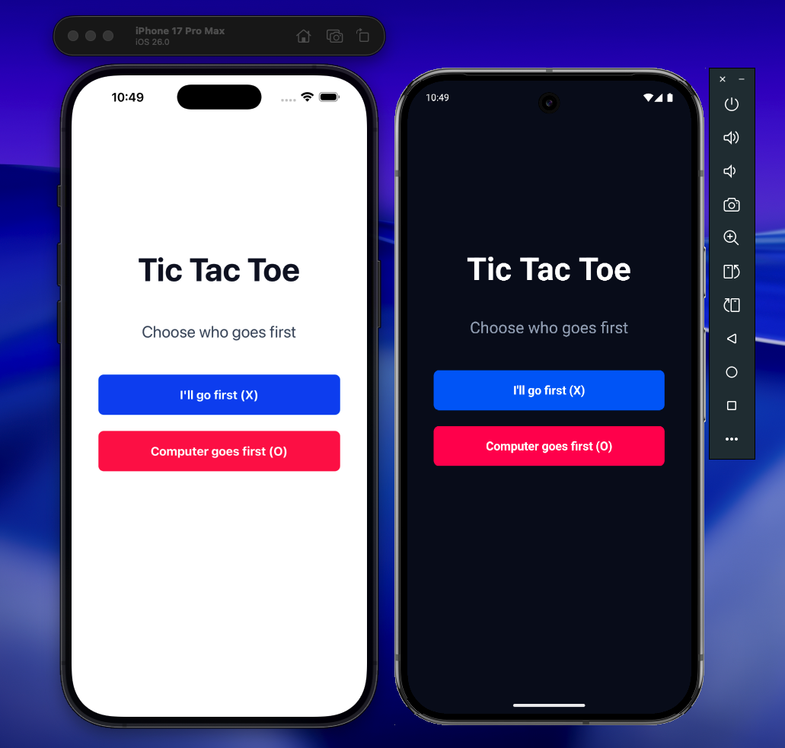

# Tic Tac Toe App Challenge

This is a single-player Tic Tac Toe game built with React Native and [Expo](https://expo.dev), featuring an unbeatable opponent.



## Prerequisites

Before you begin, ensure you have the following installed:

- **Node.js**: 20.x or higher
- **bun**: 1.1.0 or higher
- **Xcode**: 14.x or higher (for iOS development)
- **Expo**: +53.x or higher
- **CocoaPods**: 1.12.x or higher
- **Android Studio**: Latest stable version
- **JDK**: 17 or higher

## Tech Stack

- **React Native**: 0.83.1
- **React**: 19.2.0
- **Tailwindcss**: 4.1.18
- **Uniwind**: 1.2.7

## Architecture & Design Patterns

### Expo SDK 55 Beta

This app is using the beta version of Expo SDK 55 which includes React Native 0.83.1 and React 19.2.0.

### Navigation Structure

The app uses Expo Router for navigation.

### Styling Approach

Uniwind provides Tailwind CSS utility classes for React Native:

```jsx
<View className='flex-1 items-center justify-center bg-white'>
  <Text className='text-2xl font-bold text-gray-900'>Hello World</Text>
</View>
```

## Solution Overview

### Challenge Requirements Implementation

This solution fulfills all challenge requirements:

- ✅ 3x3 grid-based Tic Tac Toe gameplay
- ✅ Player choice: go first or let computer go first
- ✅ "You Won" screen on player victory
- ✅ "You Lost" screen on computer victory
- ✅ Game restart capability after completion
- ✅ Unbeatable computer using **Minimax algorithm**
- ✅ Prevents moves on occupied cells
- ✅ Computer blocks player wins and pursues victories
- ✅ Comprehensive README with technical documentation

### Game Flow

The main app manages two screens via `gameState`:

1. **Menu Screen**: Player selects whether to go first (`playerGoesFirst` boolean)
2. **Game Screen**: Game component receives the selection and initializes accordingly

State transitions:

- `"menu"` → `"playing"` when `startNewGame()` is called
- `"playing"` → `"menu"` when `resetToMenu()` is called

### Game Component Architecture (Game Component)

#### State Management

- `board`: 9-element array representing the grid
- `isPlayerTurn`: Toggle between player and computer turns
- `playerSymbol` / `computerSymbol`: Dynamically assigned based on who goes first
- `gameState`: Tracks "won", "lost", "tie", or `null` (playing)
- `isProcessing`: Prevents input during computer's decision delay

#### Unbeatable AI: Minimax Algorithm

The `minimax()` function recursively evaluates all possible board states:

```typescript
minimax(currentBoard, depth, isMaximizing);
// Returns: 10 - depth (computer wins), depth - 10 (player wins), 0 (tie)
// Depth penalizes slower wins and faster losses for optimal play
```

**Key features**:

- **Win evaluation**: Computer always pursues winning moves (score +10)
- **Loss prevention**: Computer blocks player wins (score -10)
- **No invalid moves**: Skips occupied cells
- **Optimal play**: Selects the move with highest score via `getBestMove()`

#### Game Flow

1. Player makes move → `handleCellPress()`
2. Check for win/tie/continuation
3. If game continues and it's computer's turn:
   - `useEffect` triggers `makeComputerMove()`
   - 500ms delay for better UX
   - Minimax calculates best move
   - Computer plays and checks game state
4. If game ends: Display result screen and allow replay

#### Result Screens

Conditional rendering shows appropriate message:

- Player victory: "You Won!"
- Computer victory: "You Lost!"
- Draw: "It's a Tie!"

## Installation

1. **Clone the repository**

   ```bash
   git clone -b develop git@github.com:gianfranco03/rn-ttt-challenge.git
   cd rn-ttt-challenge
   ```

2. **Install dependencies**

   ```bash
   bun install
   # or
   yarn install
   ```

### Development Server

#### With Expo GO

```bash
# Start Metro bundler
bun start

# Reset cache if needed
bun start -- --reset-cache
```

Press `i` into the terminal to run de project for iOS. Press `a` into the terminal to run the project for android.

In the output, you'll find options to open the app in a

- [development build](https://docs.expo.dev/develop/development-builds/introduction/)
- [Android emulator](https://docs.expo.dev/workflow/android-studio-emulator/)
- [iOS simulator](https://docs.expo.dev/workflow/ios-simulator/)
- [Expo Go](https://expo.dev/go), a limited sandbox for trying out app development with Expo

#### Pre Builds (Recommended)

```bash
# run prebuilds
bunx expo prebuild

# iOS
bunx expo run:ios
# or
bun ios

# android
bunx expo run:android
# or
bun android
```

## Available Scripts

```bash
# Start Metro bundler
bun start

# Run on iOS
bun ios

# Run on Android
bun android

# Linting
bun lint

# Run tests
yarn test
```

## Testing

### Unit Tests

Note: This project was configured with bun as the default package manager. But for the tests to run you need to use yarn since jest is not compatible with bun.

```bash
# Run all tests
yarn test

# Run tests in watch mode
yarn test -- --watch

# Run tests with coverage
yarn test -- --coverage
```

### Common Issues

#### iOS Build Failures

```bash
# Clean iOS build
cd ios
rm -rf Pods Podfile.lock
pod install
cd ..
```

#### Android Build Failures

```bash
# Clean Android build
cd android
./gradlew clean
cd ..
```

## Support

For issues and questions:

- Create an issue in the repository
- Contact the developer at <gianfrancohj03@gmail.com>
